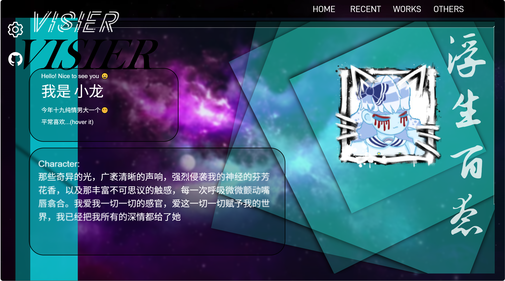
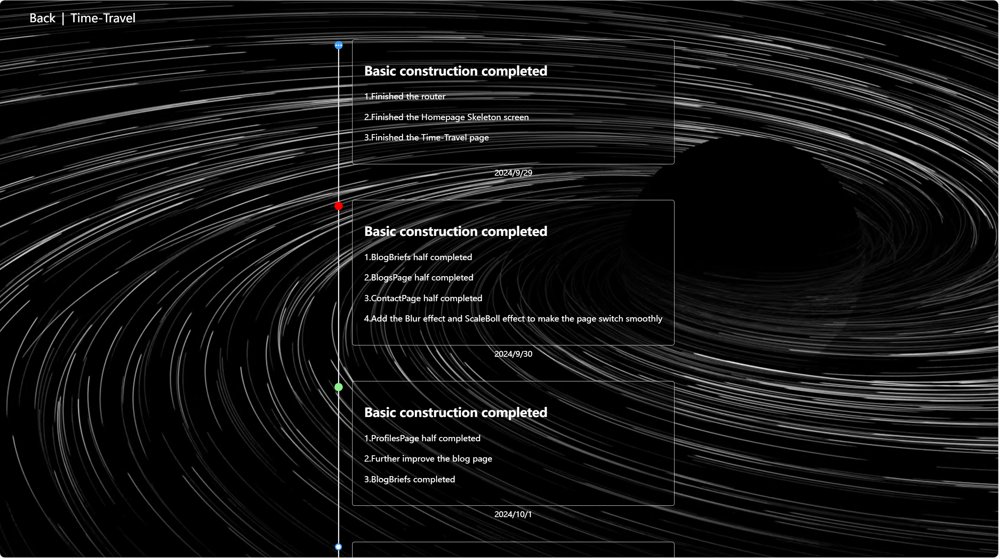
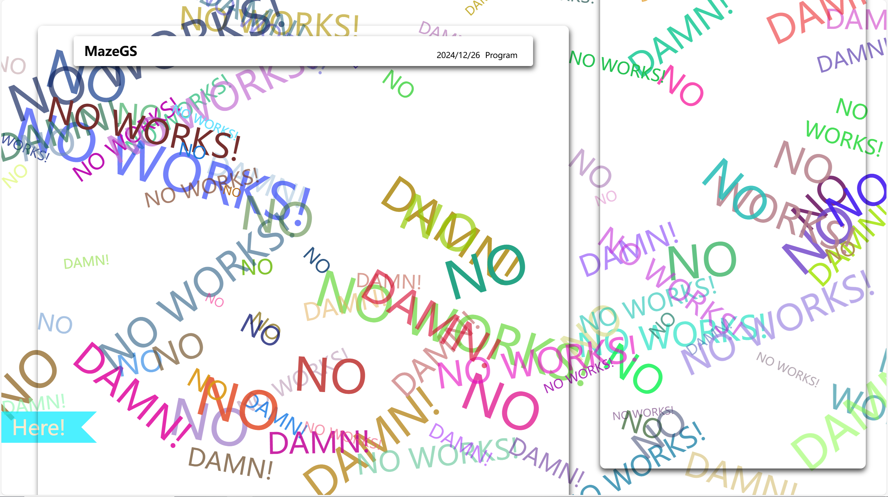
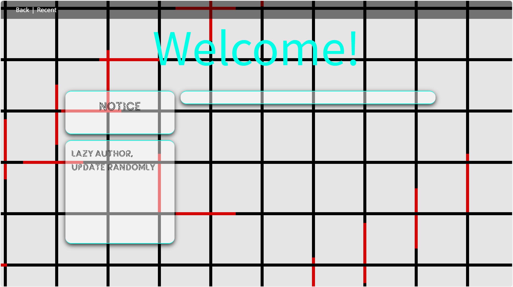

# VBLOG

> 一个始于热情，终于热情的博客项目 —— 虽已寿终正寝，但仍留有余温。

---

## ✨ 项目简介

这是一个全栈博客系统，前端使用 Vue 纯手搓完成，后端基于 Express，整体结构简单直接。

- 🌱 **前端**：Vue + Vite，无组件库，全手工打造 UI。
- 🔧 **后端**：Express + JWT + Multer + 文件系统存储，基本能跑，不求优雅。
- 📦 **数据存储**：文件系统 + JSON，采用SQLite轻量部署

---

## 🔗 项目链接

- 项目主页：https://visier.icu
- GitHub 地址：[https://github.com/Visier-Ey/VBlog](https://github.com/Visier-Ey/VBlog)

## 📸 项目截图

Home：

Archives:

Project：

Recent：

---

